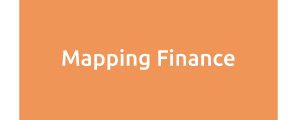

ERF acts as the secretariat for IDEAs (International Development Economics Associates), an international network of development economists, with more than 4000 network members based in more than 120 countries across the world. IDEAs is engaged in research, teaching and dissemination of critical analyses of economic policy and development. Its members are motivated by the need to strengthen and develop alternatives to the current mainstream economic paradigm as formulated by the neoliberal orthodoxy.

IDEAs was established in September 2001, following a conference in Cape Town, South Africa, on ‘Rethinking Development Economics’ organised by the United Nations Research Institute for Social Development (UNRISD) with the support of Ford Foundation.

ERF acts as the secretariat for IDEAs (International Development Economics Associates).

MacroScan seeks to provide an alternative to conservative and mainstream positions in economics. It undertakes and disseminates analyses, by professional economists, of the Indian and global economy. MacroScan also attempts to build capacities to undertake such analyses in order to strengthen those advocating an alternative economic paradigm. 

Towards this end it has built a comprehensive database on the Indian economy. The database includes time series information dating from as early as the 1950s, on a host of variables in the areas of national accounts, money supply, public finance, prices, agricultural and industrial production, trade and the balance of payments.

MappingFinance is a joint initiative of International Development Economics Associates (IDEAs) and the Economic Research Foundation in collaboration with the Levy Economics Institute of Bard College and with support from the Ford Foundation under its Reforming Global Financial Governance initiative.
mappingfinance.org seeks to contribute to this project by mapping developments in financial sectors, particularly in Asia. It seeks to track and analyse broader global developments, contextualise their impact on emerging economies and trace attempts to regulate financial sectors and address the challenges faced therein.